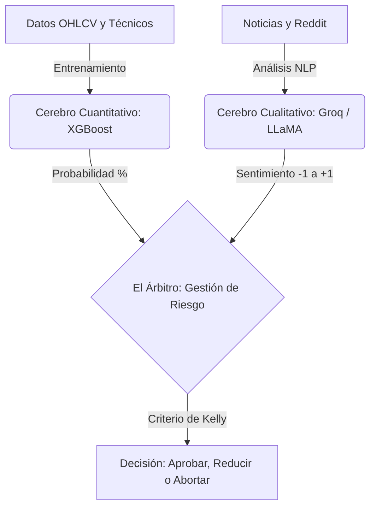

<h1 align="center"> NOSTRADAMUS </h1>

<p align="center">
  <strong>Sistema Híbrido de Trading Basado en IA (XGBoost + LLMs)</strong>
</p>

---

## 🏗️ Nueva Arquitectura de 3 Pilares

El proyecto evolucionó de un prototipo secuencial a un sistema híbrido que combina la precisión matemática con el análisis de contexto del mundo real.



## 📁 Estructura del Proyecto

Esta estructura está diseñada para facilitar la experimentación científica y el desarrollo del modelo:

```text
Nostradamus-main/
├── notebooks/                 # Cuadernos Jupyter para experimentación y aprendizaje
│   └── Tesis del Trader.ipynb
├── data/                      # Base de datos local
│   ├── raw/                   # Datos crudos (descargados de APIs)
│   └── processed/             # Datos limpios con indicadores matemáticos
├── src/                       # Código fuente de producción
│   ├── data_pipeline/         # Scripts para automatizar descargas de datos
│   ├── models/                # Código para entrenar y guardar XGBoost
│   ├── llm_agent/             # Interacción con la API de Groq
│   └── risk_manager/          # Lógica del Árbitro y Criterio de Kelly
├── docs/                      # Documentación del proyecto (PDFs y Hoja de Ruta)
├── legacy_v1/                 # Código original del prototipo secuencial V1
├── .env.example               # Plantilla para variables de entorno
└── requirements.txt           # Dependencias del proyecto
```

## 📦 Instalación Rápida

```bash
# Crear entorno virtual (si no existe)
python -m venv .venv

# Activar (Windows)
.venv\Scripts\activate

# Instalar dependencias necesarias para Ciencia de Datos e IA
pip install -r requirements.txt
pip install jupyter pandas yfinance matplotlib xgboost scikit-learn
```

## 🚀 Cómo Empezar
Todo el desarrollo iterativo ocurre en la carpeta `notebooks/`. Para iniciar el entorno:
```bash
jupyter notebook
```
