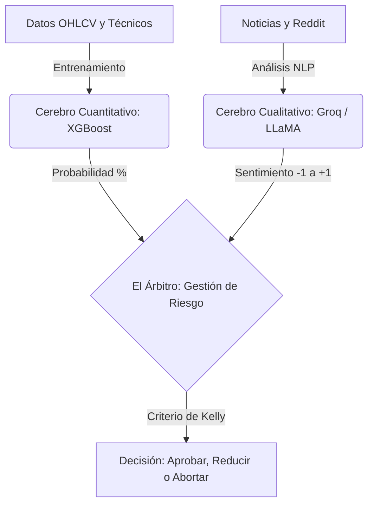

<h1 align="center"> NOSTRADAMUS </h1>

<p align="center">
  <strong>Sistema Híbrido de Trading Basado en IA (XGBoost + LLMs)</strong>
</p>

---

## 🏗️ Nueva Arquitectura de 3 Pilares

El proyecto evolucionó de un prototipo secuencial a un sistema híbrido que combina la precisión matemática con el análisis de contexto del mundo real.



## 📁 Estructura del Proyecto

Esta estructura está diseñada para facilitar la experimentación científica y el desarrollo del modelo:

```text
Nostradamus-main/
├── notebooks/                 # Cuadernos Jupyter para experimentación y aprendizaje
│   └── Tesis del Trader.ipynb
├── data/                      # Base de datos local
│   ├── raw/                   # Datos crudos (descargados de APIs)
│   └── processed/             # Datos limpios con indicadores matemáticos
├── src/                       # Código fuente de producción
│   ├── data_pipeline/         # Scripts para automatizar descargas de datos
│   ├── models/                # Código para entrenar y guardar XGBoost
│   ├── llm_agent/             # Interacción con la API de Groq
│   └── risk_manager/          # Lógica del Árbitro y Criterio de Kelly
├── docs/                      # Documentación del proyecto (PDFs y Hoja de Ruta)
├── legacy_v1/                 # Código original del prototipo secuencial V1
├── .env.example               # Plantilla para variables de entorno
└── requirements.txt           # Dependencias del proyecto
```

## 📦 Instalación Rápida

```bash
# 1. Crear entorno virtual (si no existe)
python -m venv venv

# 2. Activar entorno virtual
# En Windows:
venv\Scripts\activate
# En Linux/Mac:
source venv/bin/activate

# 3. Instalar dependencias
pip install -r requirements.txt

# 4. Configurar variables de entorno
# Copia .env.example a .env y añade tu GROQ_API_KEY
copy .env.example .env
```

---

## ⚡ Modos de Ejecución y Casos de Uso (CLI)

El sistema cuenta con un orquestador principal [`main.py`](file:///c:/Users/kevin.arango.a/Documents/GitHub/Nostradamus_V2/main.py) que ejecuta el pipeline de los 3 pilares de forma automatizada.

### 📋 Tabla de Parámetros Disponibles

| Parámetro | Tipo | Valor por Defecto | Descripción |
|---|---|---|---|
| `--ticker` | `str` | `BTC-USD` | Símbolo del activo en Yahoo Finance (ej. `BTC-USD`, `ETH-USD`, `AAPL`, `NVDA`). |
| `--activo` | `str` | `Bitcoin` | Nombre del activo para buscar noticias en Google News RSS (ej. `Bitcoin`, `Ethereum`, `Apple`). |
| `--inicio` | `str` | `2022-01-01` | Fecha inicial de datos históricos en formato `YYYY-MM-DD`. |
| `--max-noticias` | `int` | `3` | Número de titulares recientes a evaluar por el Cerebro Cualitativo (LLM). |
| `--idioma` | `str` | `en` | Idioma de las noticias RSS: `en` (inglés, mayor cobertura) o `es` (español). |

---

### 💡 Casos de Uso de Ejecución

#### Caso 1: Ejecución Estándar (Bitcoin por Defecto)
No necesitas escribir ningún parámetro; usa los valores óptimos por defecto:
```bash
python main.py
```

#### Caso 2: Criptoactivos Alternativos (Ethereum o Solana)
Personaliza el ticker de Yahoo Finance y el término de búsqueda de noticias:
```bash
# Para Ethereum
python main.py --ticker ETH-USD --activo Ethereum

# Para Solana con 5 noticias
python main.py --ticker SOL-USD --activo Solana --max-noticias 5
```

#### Caso 3: Noticias en Español
Si prefieres analizar el sentimiento a partir de medios en español (América Latina / España):
```bash
python main.py --ticker BTC-USD --activo Bitcoin --idioma es
```

#### Caso 4: Entrenamiento con Historial Extendido
Entrena el modelo XGBoost con una ventana temporal más amplia para mayor robustez estadística:
```bash
python main.py --ticker BTC-USD --activo Bitcoin --inicio 2019-01-01
```

#### Caso 5: Acciones del Mercado Tradicional (Wall Street)
El sistema también opera con activos tradicionales como Apple o Nvidia:
```bash
# Para Apple
python main.py --ticker AAPL --activo Apple --inicio 2021-01-01 --max-noticias 5

# Para Nvidia
python main.py --ticker NVDA --activo Nvidia --inicio 2022-01-01
```

#### Caso 6: Control Total (Todos los Parámetros Combinados)
```bash
python main.py --ticker ETH-USD --activo Ethereum --inicio 2021-01-01 --max-noticias 5 --idioma en
```

#### Ayuda Interactiva en Consola
Para consultar la documentación de los argumentos directamente en la terminal:
```bash
python main.py --help
```

---

## 🐍 Uso Modular en Código Python

También puedes importar y utilizar cualquiera de los componentes de forma independiente en tus propios scripts o notebooks:

```python
from src.data_pipeline import descargar_datos, calcular_caracteristicas, obtener_titulares_rss
from src.models import XGBoostTrader
from src.llm_agent import SentimentAnalyzer
from src.risk_manager import ArbitroRiesgo, calcular_criterio_kelly

# 1. Descargar datos y calcular características
df_raw = descargar_datos(ticker="BTC-USD", fecha_inicio="2022-01-01")
df_feat = calcular_caracteristicas(df_raw, sma_window=20)

# 2. Entrenar y evaluar XGBoost
modelo = XGBoostTrader(n_estimators=100, learning_rate=0.1)
X_train, X_test, y_train, y_test = modelo.preparar_datos(df_feat)
modelo.entrenar(X_train, y_train)
probabilidad_subida = modelo.predecir_probabilidad(X_test.iloc[[-1]])

# 3. Radar RSS + Análisis LLM con Groq
noticias = obtener_titulares_rss(activo="Bitcoin", max_noticias=3)
analyzer = SentimentAnalyzer()
noticias_analizadas = analyzer.analizar_titulares(noticias)
sentimiento_consenso = analyzer.obtener_consenso_sentimiento(noticias_analizadas)

# 4. Decisión del Árbitro
arbitro = ArbitroRiesgo(ratio_ganancia_perdida=1.0)
decision = arbitro.evaluar(
    probabilidad_xgb=probabilidad_subida,
    sentimiento_llm=sentimiento_consenso,
    contexto_noticia=analyzer.generar_resumen_contexto(noticias_analizadas)
)
```

---

## 📓 Experimentación Interactiva (Notebooks)
Para ejecutar y experimentar paso a paso con visualizaciones interactivas:
```bash
jupyter notebook notebooks/"Tesis del Trader.ipynb"
```
