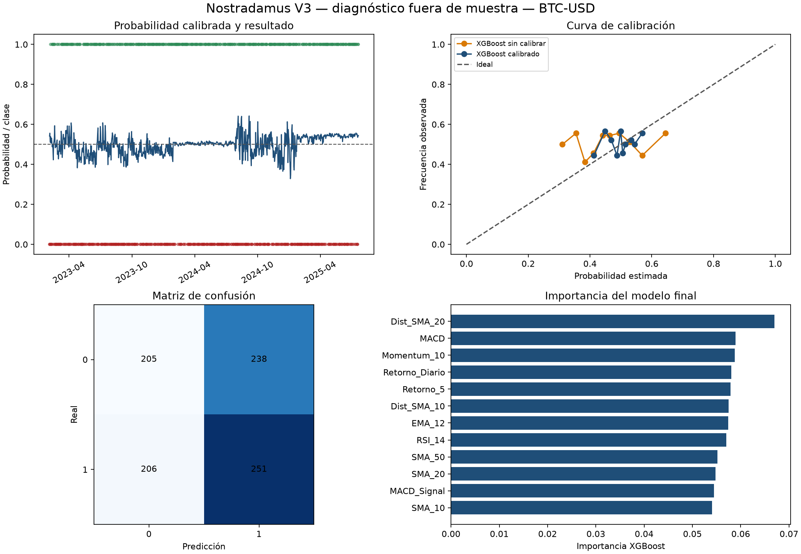
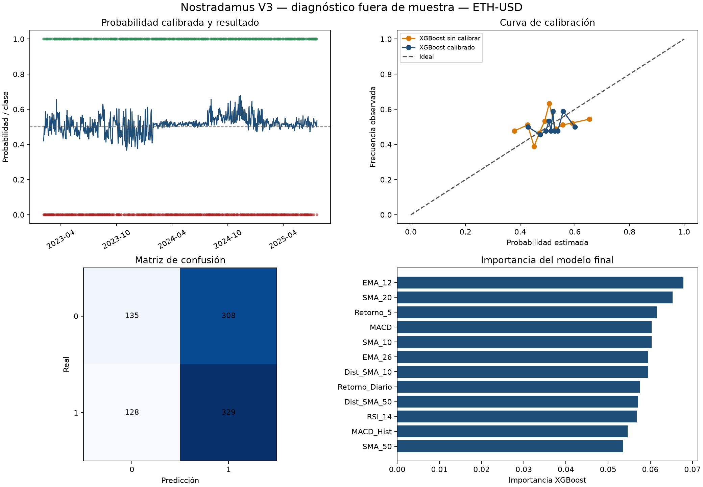

# Demostración Nostradamus V3

## Alcance

Esta demostración evalúa exclusivamente el cerebro cuantitativo. No ejecuta operaciones, no usa sentimiento y no afirma rentabilidad. Las probabilidades se evalúan fuera de muestra mediante ventanas temporales sin mezcla aleatoria.

## Diseño experimental

- Versión: `3.0.0`.
- Periodo solicitado: 2020-01-01 a 2026-09-17 (límite final exclusivo).
- Entrenamiento inicial: 900 observaciones.
- Calibración: 180 observaciones posteriores.
- Prueba: 180 observaciones posteriores por ventana.
- Máximo de ventanas: 5.
- Selección interna: 3 particiones temporales.
- Umbral de clasificación: 0.50.

## BTC-USD

Evaluación agregada sobre 900 observaciones y 5 ventanas.
Periodo fuera de muestra: 2023-02-03 a 2025-07-21.

| Modelo | Accuracy | Accuracy balanceada | F1 | MCC | ROC AUC | Brier | Log loss | ECE |
|---|---:|---:|---:|---:|---:|---:|---:|---:|
| XGBoost calibrado | 0.5067 | 0.5060 | 0.5307 | 0.0120 | 0.5098 | 0.2513 | 0.6958 | 0.0285 |
| XGBoost sin calibrar | 0.5011 | 0.5037 | 0.4084 | 0.0078 | 0.5091 | 0.2603 | 0.7149 | 0.0875 |
| Línea base constante | 0.5078 | 0.5000 | 0.6735 | 0.0000 | 0.4742 | 0.2502 | 0.6936 | 0.0048 |

- Frente a la línea base, el Brier score del modelo calibrado no mejora.
- La calibración sigmoid reduce el Brier score respecto a la probabilidad cruda.
- Estos resultados miden calidad predictiva; todavía no incluyen costos, posiciones ni métricas de trading.

Artefactos: `BTC_USD`.

## ETH-USD

Evaluación agregada sobre 900 observaciones y 5 ventanas.
Periodo fuera de muestra: 2023-02-03 a 2025-07-21.

| Modelo | Accuracy | Accuracy balanceada | F1 | MCC | ROC AUC | Brier | Log loss | ECE |
|---|---:|---:|---:|---:|---:|---:|---:|---:|
| XGBoost calibrado | 0.5156 | 0.5123 | 0.6015 | 0.0271 | 0.5180 | 0.2510 | 0.6953 | 0.0207 |
| XGBoost sin calibrar | 0.5300 | 0.5302 | 0.5263 | 0.0605 | 0.5301 | 0.2526 | 0.6988 | 0.0330 |
| Línea base constante | 0.5078 | 0.5000 | 0.6735 | 0.0000 | 0.4769 | 0.2506 | 0.6943 | 0.0179 |

- Frente a la línea base, el Brier score del modelo calibrado no mejora.
- La calibración sigmoid reduce el Brier score respecto a la probabilidad cruda.
- Estos resultados miden calidad predictiva; todavía no incluyen costos, posiciones ni métricas de trading.

Artefactos: `ETH_USD`.

## Criterio de lectura

Una mejora aislada no basta para declarar superioridad. La fase 5 deberá comprobar estabilidad entre activos, sensibilidad a costos y efecto sobre retorno y drawdown. La V3 deja esas conclusiones abiertas deliberadamente.
