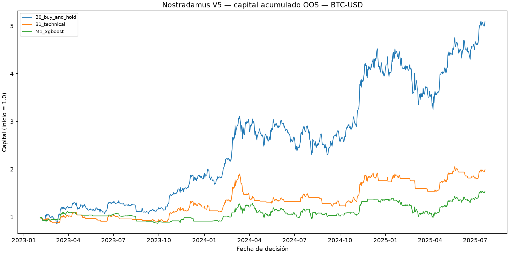
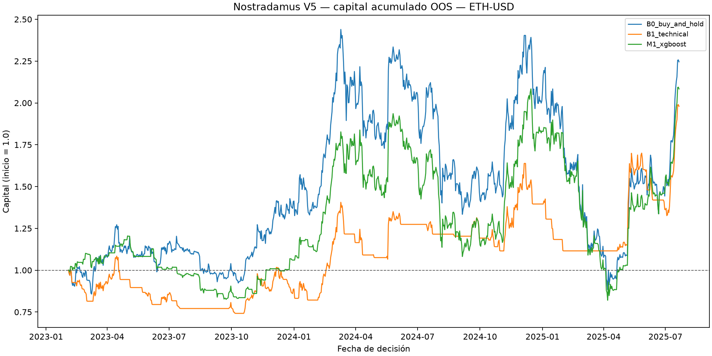

# Demostración Nostradamus V5

## Alcance

Backtesting fuera de muestra con ejecución causal en la siguiente apertura, costos por cambio de posición y liquidación final. No representa rentabilidad futura ni autoriza operar capital real.

## Estrategias

- B0: exposición larga continua en las ventanas OOS.
- B1: regla Close > SMA-20 y RSI >= 50.
- M1: probabilidad calibrada de XGBoost.
- M2: M1 filtrado por sentimiento no negativo.
- M3: Kelly fraccional limitado y modulado por sentimiento.

## BTC-USD

| Estrategia | Retorno total | Sharpe | Sortino | Drawdown máximo | Exposición | Entradas | Costos |
|---|---:|---:|---:|---:|---:|---:|---:|
| B0_buy_and_hold | 4.1027 | 1.6105 | 2.5816 | -0.2814 | 1.0000 | 1 | 0.0030 |
| B1_technical | 0.9900 | 0.9762 | 1.2206 | -0.3561 | 0.5544 | 51 | 0.1530 |
| M1_xgboost | 0.5384 | 0.6594 | 0.8299 | -0.2920 | 0.5433 | 105 | 0.3150 |

Cobertura de sentimiento alineada: 0.0000 (0 de 900 filas).

M2 y M3: **no evaluables**. No existe suficiente historia de sentimiento real alineada con las predicciones OOS; M2 y M3 no se puntúan ni se comparan.

## ETH-USD

| Estrategia | Retorno total | Sharpe | Sortino | Drawdown máximo | Exposición | Entradas | Costos |
|---|---:|---:|---:|---:|---:|---:|---:|
| B0_buy_and_hold | 1.2457 | 0.8325 | 1.2813 | -0.6379 | 1.0000 | 1 | 0.0030 |
| B1_technical | 0.9797 | 0.8617 | 1.0580 | -0.3192 | 0.4411 | 40 | 0.1200 |
| M1_xgboost | 1.0835 | 0.8051 | 1.1098 | -0.6063 | 0.7078 | 86 | 0.2580 |

Cobertura de sentimiento alineada: 0.0000 (0 de 900 filas).

M2 y M3: **no evaluables**. No existe suficiente historia de sentimiento real alineada con las predicciones OOS; M2 y M3 no se puntúan ni se comparan.

## Lectura obligatoria

Las comparaciones híbridas solo se publican cuando alcanzan la cobertura mínima configurada. La ausencia de noticias no se transforma en sentimiento neutral. Los archivos de sensibilidad muestran el efecto de costos, umbrales, calibración y ventanas walk-forward.
